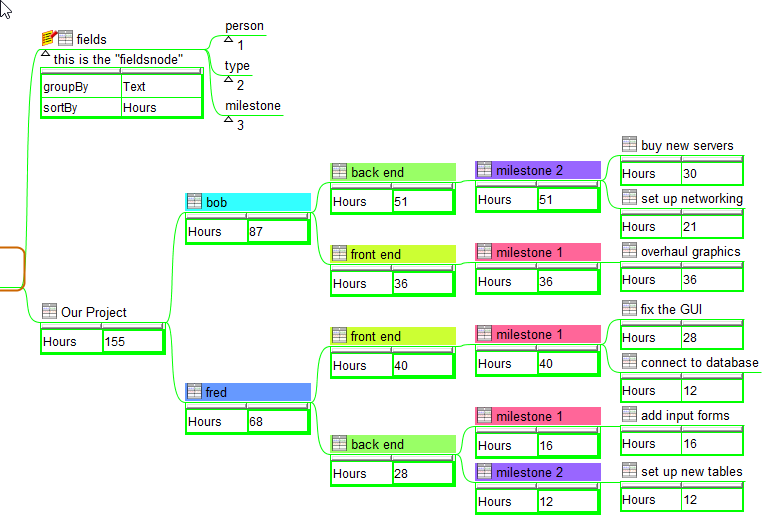

# Freepane_Hierarchy-Swap (Swap-o-Matic)

**Swap-O-Matic** is an AddOn for **Freeplane** that helps to easily swap hierarchical levels of nodes in an easy and useful way

You can get the last .addon.mm file for downloading in the [releases](https://github.com/EdoFro/Freepane_Hierarchy-Swap/releases) section.

---

More examples and a more detailed explanation in the Freeplane map **"Swap-O-Matic guide.mm"** (it gets installed with the AddOn)

---

## TOC

[Simple Swap](#simple-swap)

[Structured Swap](#structured-swap)

[About Freeplane](#about-freeplane)

[About Hierarchy Swapping and other applications](#about-hierarchy-swapping)

---

## Simple Swap

In the following image you can see an example of an **hierarchical swap**:

in red you can see that the order changes, but the combination "Mike" and "dogs" allways shows "too noisy"

---

### how to

To do a simple swap you have to

1. select the node that contains the nodes to be swaped.  
(The nodes that swaps are the children and grandchildren of the selected node)

2. execute the swap command

### known issues

1. What if the selected node has no children, or if one of its children has no children?

   - it won't work and throws an error

---

## Structured Swap

For more complexes cases where you have a branch with multiple levels and want to swap 3 or 4 of them, you can use the **Structured Swapping**

In those cases you can

1. add a node with the list of the fields representing the nodes levels (kind of column names)

1. change the order of the fields in this node

1. apply the swap command

Here's an example:

---

The **fieldsnode** contains the list of the names the user consider describes the diferent levels inside the branch

- This example has only three swapable levels, but you can have more if you need. It works in the same way.

- be aware that if there are too many swapables levels it will take more time to do all the swaping.

**FieldsNode** has two *attributes* that define how the swap command has to work on that branch

| Attribute | does |
| --- | --- |
| groupBy | defines which node's information is used for recognizing similar nodes (node's text, detail, attribute, ...) |
| sortBy | defines which node's information is used to sort the nodes |

---

To do a structured swap you have to

- **to initialize the branch**
    1. add a new node (just above the basenode of your toBeSwaped Branch as its sibling )
    2. add to it some childnodes listing the levels of the toBeSwaped Branch
    3. select it and apply the initalizeFieldsNode command
    4. select groupBy parameter
    5. select sortBy parameter

- **swaping**
    1. reorder the nodes in the FieldsNode
    2. select a node in the baseNode or in the FieldsNode branches
    3. Apply the swap command

- **re-initalization**
   if you want to change the grouping and / or the sorting criteria, just select the FieldsNode and apply the initalizeFieldsNode command again

### some examples:

1. The same branch using an adding formula in the "Hours" attribute:

2. Now sorted by the amount in Hours (descending):

3. Now with the formula as node's text and grouped by the node's details:

## This AddOn is still beta

So it may have a lot of bugs. Use it at your own risk. (**Freeplane** has an excelent "*Undo*" implementation, so the risk is in fact very limited)

Please report any bug in this addOn in its GitHub page

## Your Help needed

I'm not very good at writing in english, so if you find any error please tell me (and please explain me how to write it correctly)

## About Freeplane

[Freeplane](https://www.freeplane.org/wiki/index.php/Home) is a free and open source software application that supports thinking, sharing information and getting things done at work, in school and at home. The software can be used for [mind mapping](https://secure.wikimedia.org/wikipedia/en/wiki/Mind_map) and analyzing the information contained in mind maps. Freeplane runs on any operating system that has a current version of Java installed. It can be run locally or [portably](https://en.wikipedia.org/wiki/Portable_application) from removable storage like a USB drive.

## About Hierarchy Swapping

Hierarchy Swapping its not a command that comes as a standard feature in Freeplane, but there are other applications that do this naturally (and a lot other features) that are worthly to know.

One of them is [TreeSheet](http://strlen.com/treesheets/) which is maintained in this [repository](https://github.com/aardappel/treesheets).

Please do yourself a favor and take a look at it. It can give you a different way to help you with your work.
